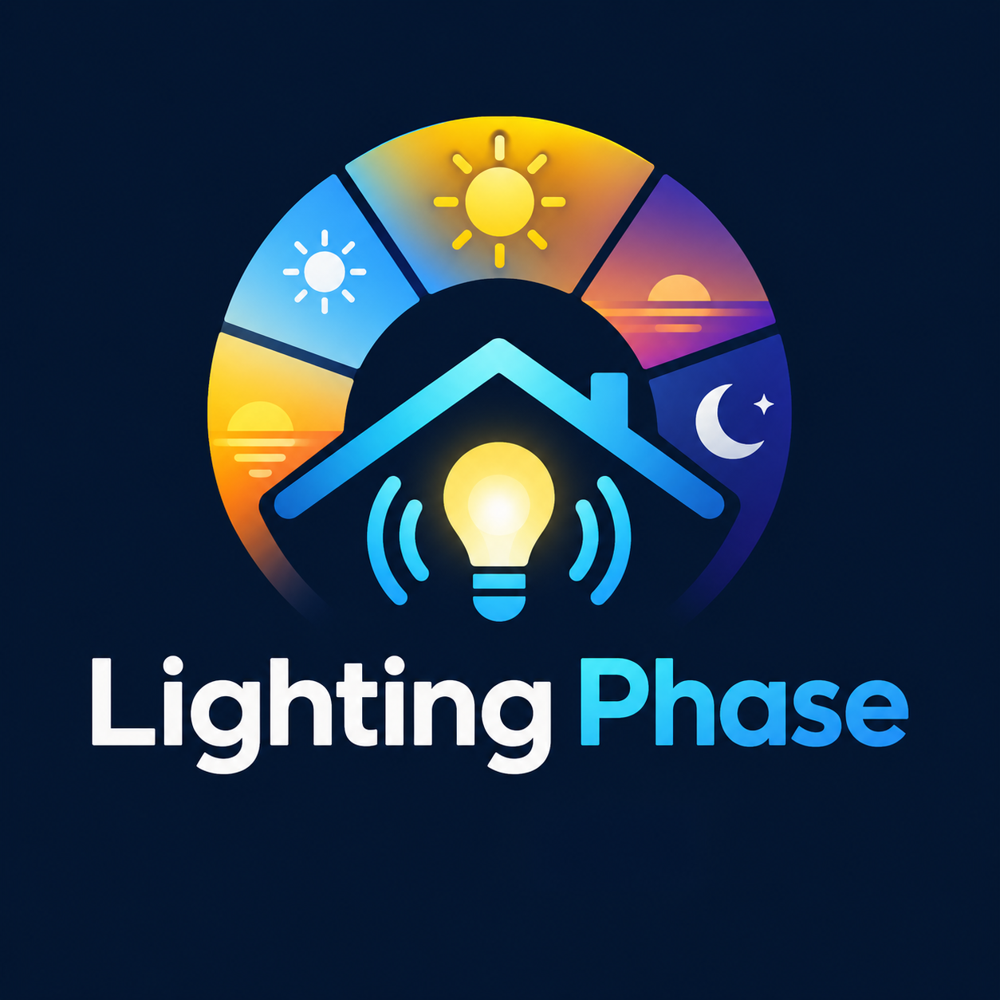

  

<h13align="center">2026, EdDuran @ Strebor Tech</h3>

**Lighting Phase** is a native Home Assistant Integration that converts Lux (light) Sensor values
.. or the Sun's Elevation at your location .. to an enumeration (HA speak, "select" entity) which
identifies: `Dawn, Morning, Day, Afternoon, Dusk, Night` lighting phases. Automations can then be
created which react to the lighting phase change.

Automations can then be created which react to the Lighting Phase change, for example:

* `Afternoon`: Turn on interior lights
* `Dusk`: Turn on exterior lights
* `Dawn`: Turn off exterior lights
* `Morning`: Turn off interior lights, which you could have been turned on manually when you got up

The Lux sensor is optional and if omitted the Lighting Phase is based purely on Sun Elevation. If the
Lux sensor is used and it goes offline (i.e., the battery dies) the mode is automatically changed to Elevation.

**Multiple Zones** The Lighting Phase integration supports multiple Zones; i.e., Devices.
Each Device has its own independent configuration; e.g., a "Backyard" Zone off one Lux Sensor
and a "Front Porch" Zone off another (or maybe just elevation-only). Each Zone maintains its own
device, entities, and thresholds, running completely independently of one another.

**Storm Mode** Lighting Phase also provides a Storm Mode to detect when it has
become appreciably darker out when not typically expected; like when a storm approaches.
The Storm Mode entity can trigger your automation to turn on some interior lights and restore
them when Storm Mode is over; generally using a scene.

## Install

1. Add the custom repository to HACS: `https://github.com/EdDuran/ha_lighting_phase.git`
2. Go to: Settings → Devices & Services → **Add Integration** → and search for "Lighting Phase".
3. Restart Home Assistant
4. Go to: Settings → Devices & Services → Lighting Phase and **Add Entry**
5. Walk through the 4-step setup for this zone:
   - **Zone name** (e.g. "Backyard"), lux sensor (optional — leave blank to
     run elevation-only), notify target, phase-change sound.
   - Lux thresholds (dawn/morning/day/afternoon/dusk/night).
   - Elevation thresholds + cross-check tolerance.
   - Storm overlay % + debounce/window/delay timing.
6. Done — a Device named after your Zone appears with all entities above.
7. **Repeat from step 4** for each additional zone. Every run of the new entry's config
   flow creates a fully independent Lighting Phase instance — its own device, entities (referencing
   Lux Sensor, or none, for elevation-only).

Per Lighting Phase Zone: The Lux Sensor, Notify Target and Debounce/storm timing constants can
be changed later from each Zone's settings (**Gear** button). The Lux and Elevation threshold values can be modified
for each zone's number entities directly.

## Entities per Lighting Phase Zone

| Entity | Notes |
|---|---|
| `sensor.{ZONE}_lighting_phase` | Read-only in normal operation; `dawn / morning / day / afternoon / dusk / night`. |
| `select.{ZONE}_lighting_mode` |  Settable; `sensor` or `elevation`. Auto-switched to `elevation` if the Lux Sensor drops out. |
| `binary_sensor.{ZONE}_storm_mode` | Read-only; Set when Storm detection occurs |
| `number.{ZONE}_storm_detection_rolling_peak` | Settable; Percent of 'rolling window' at which Storm Mode is enabled |
| `number.{ZONE}_lux_dawn` | Settable; The Lux value at which Dawn occurs | 
| `number.{ZONE}_lux_morning` | Settable; The Lux value at which Morning occurs |
| `number.{ZONE}_lux_day` | Settable; The Lux value at which Day occurs | 
| `number.{ZONE}_lux_afternoon` | Settable; The Lux value at which Afternoon occurs |
| `number.{ZONE}_lux_dusk` | Settable; The Lux value at which Dusk occurs |
| `number.{ZONE}_lux_night` | Settable; The Lux value at which Night occurs | 
| `number.{ZONE}_elevation_tolerance` | Settable; The Elevation tolerance required to transition based on Lux value |
| `number.{ZONE}_elevation_dawn` | Settable; The Sun Elevation value at which Dawn occurs |
| `number.{ZONE}_elevation_morning` | Settable; The Sun Elevation value at which Morning occurs |
| `number.{ZONE}_elevation_day` | Settable; The Sun Elevation value at which Day occurs |
| `number.{ZONE}_elevation_afternoon` | Settable; The Sun Elevation value at which Afternoon occurs |
| `number.{ZONE}_elevation_dusk` | Settable; The Sun Elevation value at which Dusk occurs |
| `number.{ZONE}_elevation_night` | Settable; The Sun Elevation value at which Night occurs |

## Services per Lighting Phase Zone

| Service | Notes |
|---|---|
| `lighting_phase.set_phase` | Provided as the "if something goes wrong" manual override (Developer Tools > Services, or call it from an automation/script). It takes a **Zone** (device picker — pick which zone's device this applies to) and a **Phase**. The Zone simply resumes computing forward from whatever phase you force it to; other Zones are untouched. |

## Options per Lighting Phase Zone

These options are settable from Settings → Devices & Services → Lighting Phase Zone, Gear icon

| Option | Notes |
|---|---|
| Lux Sensor | Optional; The Lux Sensor Entity, or omitted if there isn't one for this Zone |
| Notify Service Target | Optional; The Home Assistant Phone to notify when Phase changes |
| Phase change notification sound | Optional; The Phone notification sound. Default: 'chime' |
| Darkening transition | Darkening minutes before Storm mode is started. Default: 1 minute |
| Brightening transition | Brightening minutes before Storm mode is exited. Default: 2 minutes |
| Storm detection rolling window | Number of minutes to look back to determine maximum Lux for Storm Mode. Default: 30 minutes |
| Delay before entering Storm Mode | Number of seconds it must be dark before enabling Storm Mode. Default: 90 seconds |
| Delay before exiting Storm Mode | Number of seconds it must be bright before disabling Storm Mode. Default: 300 seconds |

## How does Storm Mode work?

* The maximum Lux value is retained over the Zone Option **Storm detection rolling window** (e.g., 30 minutes)
* Storm Mode enabled - When the Lux value drops below entity `number.{ZONE}_storm_detection_rolling_peak` percent (e.g., 50%) of the maximum for Option **Darkening transition** minutes (e.g., 1 minute) for Option **Delay before entering Storm Mode** seconds (e.g., 90 seconds)
* Storm Mode disabled - When the Lux value rises over the rolling peak for Option **Brightening transition** minutes (e.g, 2 minutes) for **Delay before exiting Storm Mode** seconds (e.g. 300 seconds).

